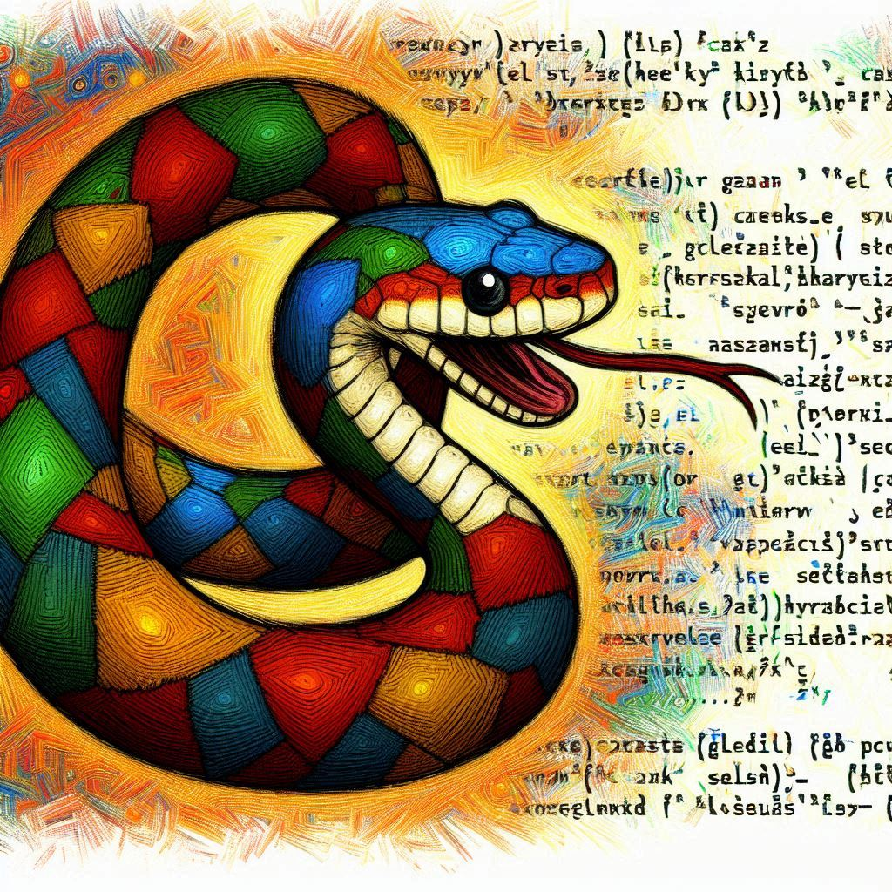

    Escute abaixo o podcast gerado através de Inteligência Artificial

    <audio src="output/podcast.mp3" controls title="Podcast editado"></audio>

<video src="https://github.com/felipeAguiarCode/prompts-for-podcast-generate-by-ia/assets/36085476/275e4109-6cf2-46d2-9c26-f31ce18edfa7"></video>

# Projeto Podcast Gerado por I.A.s

Projeto com o objetivo de gerar um podcast utilizando ferramentas de IA através de Prompt Engineering.

## 💻 Tecnologias utilizadas no projeto

- [ChatGPT](https://chat.openai.com/) 
- [DALL-E](https://www.bing.com/images/create)
- [ElevenLabs](https://beta.elevenlabs.io/)

## ✨ Como foi feito ?

- Roteiro gerado via ChatGPT
- Áudio gerado pela ElevenLabs a partir do roteiro escrito
- DALL-E para gerar imagem de capa

## 📚 Materiais

|         | Prompt                                                                                                                                                                                                                                                                                                                                                                                                                                                                                                                                                                                                                                                                                                                                                                                                                                                                                                                                                                                                                                                                                                                                                                                                                        |
|---------|-------------------------------------------------------------------------------------------------------------------------------------------------------------------------------------------------------------------------------------------------------------------------------------------------------------------------------------------------------------------------------------------------------------------------------------------------------------------------------------------------------------------------------------------------------------------------------------------------------------------------------------------------------------------------------------------------------------------------------------------------------------------------------------------------------------------------------------------------------------------------------------------------------------------------------------------------------------------------------------------------------------------------------------------------------------------------------------------------------------------------------------------------------------------------------------------------------------------------------|
| DALL-E  | Create a hand drawn impressionist image that depicts a python snake and programing code. The python snake is interacting with the code in some way                                                                                                                                                                                                                                                                                                                                                                                                                                                                                                                                                                                                                                                                                                                                                                                                                                                                                                                                                                                                                                                                            |
| ChatGPT | Seja um roteirista de podcast. Você deve criar um roteiro para um podcast de tecnologia, chamado "Código Serpente", que tem como tema a linguagem Python e será apresentada por uma garota chamada Sara. O primeiro episódio será sobre código pythônico, o que são e exemplos do que fazer e o que não fazer para que um código seja considerado pythônico e sobretudo, belo, fácil de entender e resistente a erros. O roteiro deve ser criado no seguinte formato e deve ter 5 minutos no total. Use termos simples e que sejam fácilmente compreendidos por um iniciante da programação e não dê exemplos em forma de código, pois são difíceis de serem entendidos quando são falados por uma voz: - Introdução: Seja animado e apresente o podcast e o assunto do episódio para os ouvintes no estilo de Raymond Hettinger, guru de Python - O que é um código pythônico e quais as vantagens de se adotar um estilo pythônico no código? - Vamos falar de loops: Fale das diferenças entre um loop sobre uma lista considerado pythônico e outro que não seja pythônico - Vamos falar de loops qure precisam de um index: Como evitar códigos não pythônicos com enumerate - Finalizando: Faça uma despedida divertida |

## 🛠️ Instruções de execução

Utilize os prompts fornecidos na parte de `Materiais` para criar um podcast de maneira automatizada, para isso siga o passo a passo abaixo.

- 🤖 1. Use os prompts de roteiro no `chagpt`
- 🤖 2. Use os prompts de roteiro gerados pelo chatgpt no  `ElevenLabs`
- 🤖 3. Use os prompts de artes no `DALL-E`